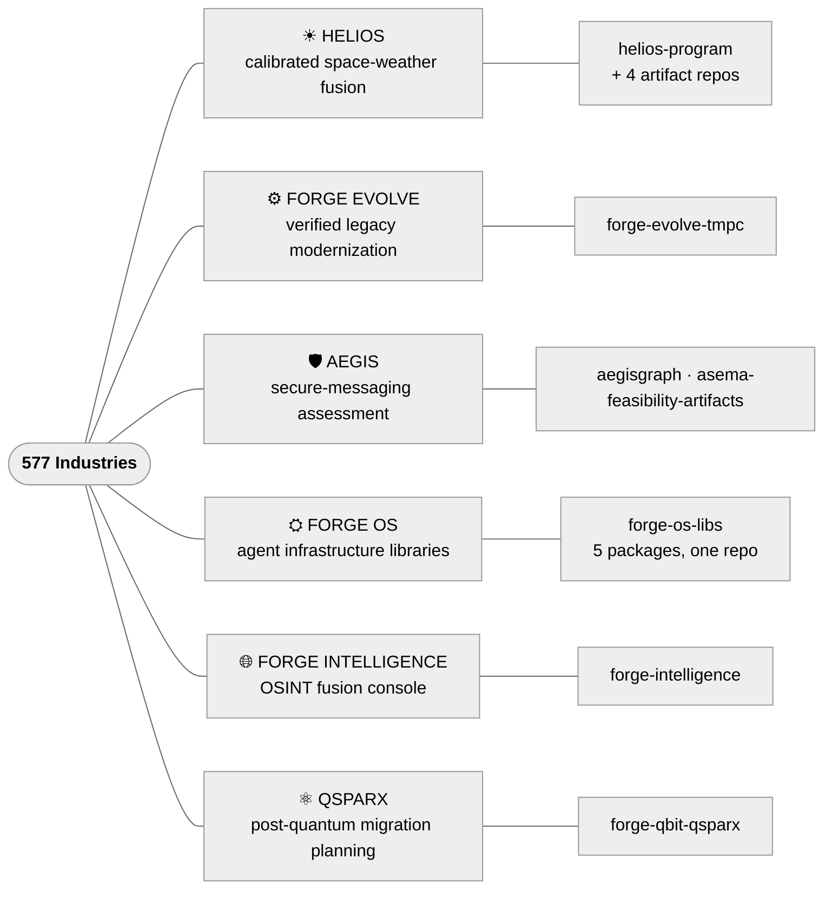

<picture>
  <source media="(prefers-color-scheme: dark)" srcset="https://raw.githubusercontent.com/577Industries/.github/main/profile/assets/banner-dark.png">
  
</picture>

  

Columbus, Ohio · Dual-use commercial & defense

---

577 Industries works across four engineering domains where rigor, provenance, and calibration matter more than throughput:

- 🧠 **AI/ML R&D** — calibrated decision systems, agent infrastructure, and applied research at the model–physics boundary
- 🤖 **Robotics** — autonomy stacks, perception, manipulation, and swarm coordination
- 🔧 **Code modernization** — legacy migration, AI-assisted refactoring, and secure modernization
- ⚛ **Frontier research** — high-energy physics, quantum sensing, and post-quantum security

Every public artifact ships with a license, a CI badge, and citable evidence. Every internal artifact is gated by a documented IP boundary. Programs land in this org iteratively as they ship; the active set is below.

---

## HELIOS — Calibrated Heliophysics Fusion

 

Multi-source space-weather fusion with feature-level provenance and calibrated uncertainty. Two vertical slices: NASA SRAG mission-operations radiation risk and U.S. precision-agriculture GNSS reliability. NASA SBIR subtopic **SPWX.1.S26A**, submitted 2026-05-18, currently under NASA evaluation.

> [!NOTE]
> **Headline result.** During the May 2024 Gannon G5 superstorm, **1,302 station-hours** of U.S. row-crop GNSS pushed past the 2.5 cm RTK tolerance — the first citable quantification of solar-storm impact on U.S. agriculture. (Climatological v1; real-SPP v2 in progress.)

| Repository | Purpose |
|---|---|
| [`helios-program`](https://github.com/577Industries/helios-program) | Umbrella meta-repo · master plan, companion doc, 4 submodules |
| [`helios-provenance-spec`](https://github.com/577Industries/helios-provenance-spec) | JSON Schema 2020-12 + W3C PROV-JSON RFC for feature-level lineage |
| [`helios-spaceweather-connectors`](https://github.com/577Industries/helios-spaceweather-connectors) | 6 production adapters · DONKI, SEP A/B/C, SWPC, GOES, DSCOVR, CDDIS GIMs |
| [`helios-fusion-engine`](https://github.com/577Industries/helios-fusion-engine) | BMA + isotonic + Mondrian conformal calibration · arXiv preprint draft |
| [`gannon-storm-rtk-analysis`](https://github.com/577Industries/gannon-storm-rtk-analysis) | May 2024 Gannon G5 retrospective on the NGS CORS network |

**Companion site →** [577industries.github.io/helios-program](https://577industries.github.io/helios-program/)

---

## FORGE EVOLVE for TMPC — AI-assisted modernization of mission-planning software

 

Behavioral-equivalence-verified AI modernization of legacy C#/.NET mission-planning software, with continuous-ATO evidence generated as a byproduct. Targets the U.S. Navy Theater Mission Planning Center (TMPC, NAVAIR PMA-281), topic **DON26BZ01-NV013** (26.B Release 1); response in preparation. This is the C#/.NET extension of 577's FORGE EVOLVE modernization framework, reproducible offline by reviewers with no API keys.

> [!NOTE]
> **Headline result.** On a synthetic, unclassified MDS-like surrogate, a modernized .NET 8 component reproduces its legacy counterpart on **2000/2000 corpus vectors with zero violations** (95% rule-of-three upper bound ≈1.5×10⁻³ on the per-vector deviation rate). The validation oracle separately flags **321 latent legacy defects** as engineering-change findings, and STIG, NIST 800-53, CycloneDX SBOM, and a tamper-evident provenance hashchain are emitted automatically. Preliminary; **not government-validated**.

| Repository | Purpose |
|---|---|
| [`forge-evolve-tmpc`](https://github.com/577Industries/forge-evolve-tmpc) | Runnable C#/.NET reference implementation · Discovery (Roslyn) → CLAR → migration planning → multi-agent transform → behavioral-equivalence validation → cATO artifacts, on a synthetic MDS-like surrogate · `make demo` runs offline and byte-deterministic · 137 tests · CI green on Linux + Windows · Apache-2.0 |

Consumes [`@577-industries/model-router`](https://github.com/577Industries/forge-os-libs/tree/main/packages/model-router) for air-gappable, sovereign-profile model routing.

**Companion site →** [577industries.github.io/forge-evolve-tmpc](https://577industries.github.io/forge-evolve-tmpc/)

---

## DARPA ASEMA — Secure Messaging Assessment (AEGIS)

 

Graph-based application-layer evidence platform for assessing Secure Messaging Applications (project codename **AEGIS**). DARPA contract HR0011SB20254-12, Tier 3 research, currently under active DARPA evaluation.

> [!IMPORTANT]
> Program materials and evaluation evidence remain intentionally limited. Published artifacts are the sanitized reproducibility set only.

| Repository | Status |
|---|---|
| [`aegisgraph`](https://github.com/577Industries/aegisgraph) | Feasibility artifact · sanitize-check gates every public export |
| [`asema-feasibility-artifacts`](https://github.com/577Industries/asema-feasibility-artifacts) | Sanitized reproducibility artifacts · consolidated into the org 2026-07. GitHub redirects the repository URL from the former founder-account path; GitHub Pages URLs are not redirected on transfer, so the documents are served at [577industries.github.io/asema-feasibility-artifacts](https://577industries.github.io/asema-feasibility-artifacts/) |

---

## FORGE OS — Agent Infrastructure

  

Reusable TypeScript libraries for production AI-agent applications. Each library implements an algorithm described in a 2025–2026 patent filing. All five live in [`forge-os-libs`](https://github.com/577Industries/forge-os-libs) and publish independently to npm.

| Package | What it does | Patent (described) |
|---|---|---|
| [`agent-memory`](https://github.com/577Industries/forge-os-libs/tree/main/packages/agent-memory) | Persistent memory · log-reinforcement, exponential decay, composite recall | Autonomous Memory Evolution · Dec 2025 |
| [`model-router`](https://github.com/577Industries/forge-os-libs/tree/main/packages/model-router) | Multi-provider routing · 6 strategies, sovereign profiles, cost ceiling | Adaptive Model Routing · Feb 2026 |
| [`tool-guardrails`](https://github.com/577Industries/forge-os-libs/tree/main/packages/tool-guardrails) | 4-level tool middleware (none/log/pause/block) + HITL approval | Governed Autonomy Framework · Jan 2026 |
| [`workflow-dag`](https://github.com/577Industries/forge-os-libs/tree/main/packages/workflow-dag) | YAML → DAG compiler · Kahn topological sort, cycle detection | Workflow DAG Compiler · Mar 2026 |
| [`hashchain-audit`](https://github.com/577Industries/forge-os-libs/tree/main/packages/hashchain-audit) | Tamper-evident audit · SHA-256 chaining + Ed25519 + Merkle anchoring | Hash-Chained Audit Ledger · Mar 2026 |

Consolidated into one repository 2026-08-09; the five original repos are archived and read-only, with their releases and history preserved. Package names and versions are unchanged — `npm i @577-industries/model-router` works exactly as before. A rebrand to `@577industries/forge-*` is on the 2026 roadmap.

---

## FORGE INTELLIGENCE — OSINT Fusion Console

 

Real-time open-source-intelligence fusion: a WebGL globe over public-domain intelligence feeds, with a passive-first reconnaissance toolkit. A hardened fork of the MIT-licensed [Osiris](https://github.com/simplifaisoul/osiris), with the security work carried in-tree.

> [!NOTE]
> **Design rule.** An unavailable source reports unavailable — feeds never fabricate a data point, and routes fail closed. Non-commercial-only feeds are disqualified regardless of data quality.

| Repository | Purpose |
|---|---|
| [`forge-intelligence`](https://github.com/577Industries/forge-intelligence) | Fusion console · layer catalog, SSRF-guarded egress, tiered reconnaissance access |

---

## QSPARX — Post-Quantum Migration Planning

 

Evidence-first synthetic cryptographic mission twin for planning post-quantum migration: cryptographic inventory, CycloneDX SBOM generation, and a digital twin of the migration surface.

> [!NOTE]
> **Waiver discipline.** Container vulnerability waivers are exact, versioned, and expiry-dated. Any change to the runtime dependency scope invalidates them and forces reassessment before CI can pass — the control is enforced in `scripts/check_container_waivers.py`, not by convention.

| Repository | Purpose |
|---|---|
| [`forge-qbit-qsparx`](https://github.com/577Industries/forge-qbit-qsparx) | Cryptographic inventory + mission twin · signed releases, reviewer Pages site |

---

## Recent

| Date | Update |
|---|---|
| **2026-08-09** | FORGE OS libraries consolidated into [`forge-os-libs`](https://github.com/577Industries/forge-os-libs) (npm packages unchanged); FORGE INTELLIGENCE and QSPARX added as programs; reproducibility fixes across the HELIOS toolchain |
| **2026-07-07** | GitHub presence consolidated: ASEMA artifacts transferred into the org (redirects preserved), org-wide brand system + repo standards shipped, `v1.0.0` releases tagged across the FORGE OS libraries |
| **2026-06-01** | FORGE EVOLVE for TMPC reference implementation published · Navy SBIR DON26BZ01-NV013 · `make demo` reproducible offline · CI green on Linux + Windows |
| **2026-05-18** | HELIOS NASA SBIR Phase I proposal submitted · now under NASA evaluation · Phase II evidence in assembly |
| **2026-03** | `forge-workflow-dag` and `forge-hashchain-audit` patents described |
| **2026-02** | `forge-model-router` patent described |
| **2025-12** | `forge-agent-memory` patent described · first FORGE OS library shipped to npm |

---

**Contact** · [info@577industries.com](mailto:info@577industries.com) · [Security policy](https://github.com/577Industries/.github/blob/main/SECURITY.md) · [Contributing](https://github.com/577Industries/.github/blob/main/CONTRIBUTING.md) · [Repo standards](https://github.com/577Industries/.github/blob/main/docs/repo-standards.md)

© 2025–2026 577 Industries Incorporated · Columbus, Ohio · Apache 2.0 except where noted

